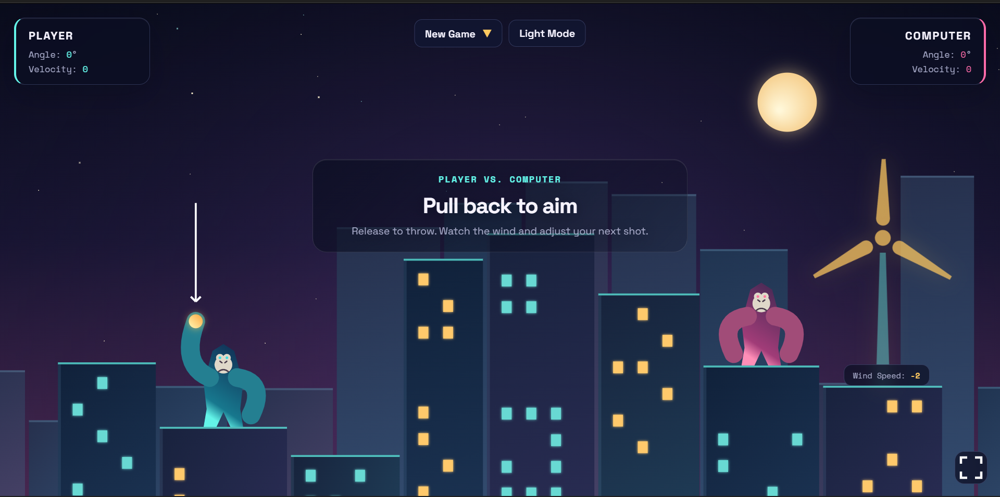
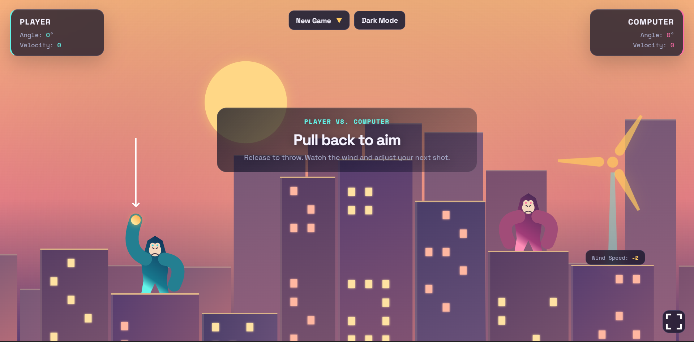
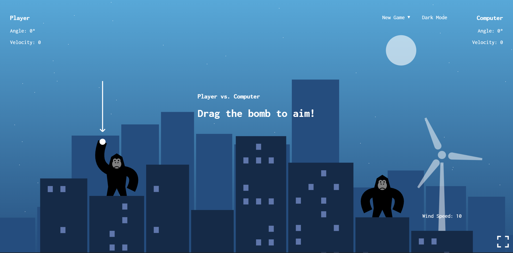
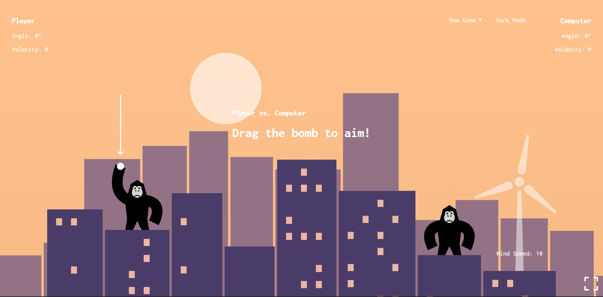

# Gorillas — Rooftop Showdown

A browser-based artillery duel set above a glowing city skyline. Pull back to aim, release to throw, and account for the wind before your opponent lands a clean hit.

**[▶ Live Demo](https://souravbanerjeedata.github.io/gorillas/)**

Two versions are available from the landing page:

| Version | Style | Description |
|---------|-------|-------------|
| **Neon City** (`version1`) | Polished neon UI | Enhanced visuals, refined HUD, richer themes |
| **Classic** (`version2`) | Lean classic feel | Core gameplay with simpler styling |

---

## Screenshots

### Neon City

| Dark Mode | Light Mode |
|-----------|------------|
|  |  |

### Classic

| Dark Mode | Light Mode |
|-----------|------------|
|  |  |

---

## How to Play

1. Open the [live demo](https://souravbanerjeedata.github.io/gorillas/) or open `index.html` locally.
2. Choose **Neon City** or **Classic**.
3. From the **New Game** menu pick:
   - **Single Player** — play against the computer
   - **Two Players** — local hot-seat on the same device
   - **Autoplay** — watch two AI gorillas battle
4. **Drag** the bomb away from your gorilla to set angle and power.
5. **Release** to throw. Watch the wind indicator and adjust your next shot.
6. Hit the opposing gorilla to win. Missed shots leave blast holes in the buildings.

### Controls

| Input | Action |
|-------|--------|
| Mouse / touch: press & drag bomb | Aim (distance = strength) |
| Release | Throw |
| **New Game** menu | Start Single Player / Two Players / Autoplay |
| **Dark Mode / Light Mode** | Toggle sky palette |
| Fullscreen button | Enter / exit fullscreen |

---

## Features

- Procedurally generated city skylines with lit windows
- Realistic projectile physics with gravity and wind
- Persistent building damage between turns
- Single-player, local two-player, and autoplay modes
- Dark and light color themes
- Fully responsive canvas + fullscreen support
- Pure HTML, CSS & Canvas 2D — no build step or dependencies

---

## Running Locally

```bash
git clone https://github.com/Souravbanerjeedata/gorillas.git
cd gorillas
# Open index.html in any modern browser
```

No package install or build required. An internet connection is only needed for the optional Google Font (system fonts are used as fallback).

---

## Project Structure

```
gorillas/
├── index.html          # Landing page — choose your version
├── version1/           # Neon City (polished edition)
│   ├── index.html
│   ├── index.css
│   └── index.js
├── version2/           # Classic edition
│   ├── index.html
│   ├── index.css
│   └── index.js
├── neon-dark.png       # Screenshots
├── neon-light.png
├── classic-dark.png
└── classic-light.png
```

---

## Credits

Inspired by the classic **Gorillas** artillery game that shipped with MS-DOS / QBasic.  
This is a modern browser reimplementation using original Canvas rendering and interface code.

---

## License

This project is open source. Feel free to play, fork, and experiment.
